# PDF Splitter Utility Plan

## Overview

This document outlines the plan for developing a production-ready, command-line PDF splitter utility in Python. The utility will prioritize user experience and robustness, employing `click` for command-line interface creation, `rich` for enhanced console output, and `PyPDF2` (or a more performant alternative) for PDF manipulation.

## Requirements

- **Functionality:** Split PDF files based on page ranges, individual pages, and fixed page counts.
- **User Experience:** Provide a clear and intuitive command-line interface with comprehensive argument parsing.
- **Error Handling:** Implement thorough error handling with specific and actionable messages.
- **Performance:** Ensure reliable and accurate PDF manipulation, with consideration for performance.
- **Compatibility:** Package the tool as a self-contained executable with cross-platform compatibility (Windows, macOS, Linux).
- **Documentation:** Include detailed, user-friendly documentation covering installation, usage examples, and troubleshooting tips.
- **Testability:** Prioritize code clarity, maintainability, and testability, including unit tests covering core functionality and edge cases.

## Detailed Plan

```mermaid
graph LR
    A[Start] --> B{Choose PDF library};
    B -- PyPDF2 --> C[Implement core splitting logic];
    B -- More performant alternative --> C;
    C --> D{Implement CLI with Click};
    D --> E[Add argument parsing];
    E --> F[Implement page range parsing];
    F --> G{Integrate Rich for enhanced output};
    G --> H[Implement progress bar];
    H --> I[Implement syntax-highlighted error messages];
    I --> J{Implement error handling};
    J --> K[Handle corrupted PDFs];
    K --> L[Handle password-protected PDFs: Attempt to remove password];
    L --> M{Implement output file naming: original_filename_page_1-5.pdf};
    M --> N{Implement output directory handling: Single directory};
    N --> O{Package as self-contained executable};
    O --> P{Write documentation};
    P --> Q[Online documentation];
    Q --> R[--help flag];
    P --> R;
    R --> S{Write unit tests};
    S --> T[Test core functionality];
    T --> U[Test edge cases];
    U --> V[End];
```

### Plan Breakdown:

- **Choose PDF library:** Evaluate `PyPDF2` and other libraries for performance and features.
- **Implement core splitting logic:** Implement the core logic for splitting PDFs based on page ranges, individual pages, and fixed page counts.
- **Implement CLI with Click:** Use `click` to create a command-line interface with subcommands and options.
- **Add argument parsing:** Implement argument parsing for input file, output directory, page ranges, and other options.
- **Implement page range parsing:** Implement parsing of complex page ranges like "1-5, 7, 9-end".
- **Integrate Rich for enhanced output:** Use `rich` to provide visually appealing console output.
- **Implement progress bar:** Add a dynamic progress bar to show the splitting progress.
- **Implement syntax-highlighted error messages:** Display error messages with syntax highlighting for better readability.
- **Implement error handling:** Implement robust error handling for various scenarios.
- **Handle corrupted PDFs:** Gracefully handle corrupted PDFs with informative error messages.
- **Handle password-protected PDFs:** Attempt to remove the password from password-protected PDFs.
- **Implement output file naming:** Use the `original_filename_page_1-5.pdf` naming convention.
- **Implement output directory handling:** Place all output files in a single directory.
- **Package as self-contained executable:** Package the tool as a self-contained executable for cross-platform compatibility.
- **Write documentation:** Write comprehensive documentation covering installation, usage examples, and troubleshooting tips.
- **Online documentation:** Make the documentation accessible online.
- **--help flag:** Implement a `--help` flag to display the documentation in the console.
- **Write unit tests:** Write unit tests to cover core functionality and edge cases.
- **Test core functionality:** Test the core splitting logic with various inputs.
- **Test edge cases:** Test edge cases like invalid page ranges, corrupted PDFs, and password-protected PDFs.

## User Preferences:

- **Password-protected PDFs:** Attempt to remove the password.
- **Output file naming:** `original_filename_page_1-5.pdf`
- **Output directory structure:** Place all output files in a single directory.
